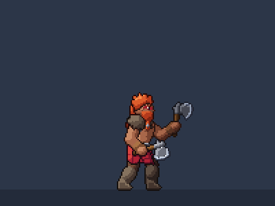
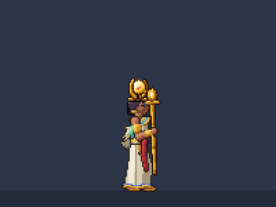

# The Loom: Reliquary of Legends — an RSL / SWGOH-style hero battler in pixel art

A turn-based hero collector in the style of **RAID: Shadow Legends** and **Star Wars: Galaxy of Heroes**, built to answer one question: *can it look and play that well with 2D pixel art?* Every sprite, animation, effect, tile, backdrop, icon, the logo, the world map and the font are **generated by code** in this repo (`npm run art`), from one palette and one light.

> **Status: Jakub's own content is coming in.** The name and the logo are final: **The Loom: Reliquary of Legends** (code name TLROL), high fantasy with a gothic arcane look. Since 2026-10-10 the game is built on his design decisions ([docs/DESIGN_DECISIONS.md](docs/DESIGN_DECISIONS.md)): the premise of the broken loom, the affinities, rarities, roles and factions, the starter and the second champion, and Zone 1 from his working notes. What he has not designed yet is marked as a stand-in: the champions' names, kits, stats and bodies, the enemies, and a first take on Zone 1's art. The engine, the tools and the guardrails stay.


- **2 champions**, the starter of the Azure Crown and the second champion of the Sanguine Dominion (names to come), each with idle, run, three attacks, hurt and death, rendered for both facings. Four factions: the Azure Crown, the Sanguine Dominion, the Court of Root and the Ashveil Reign.
- **A combat background** for Zone 1, *A Dim Island*: the green at the edge of a small settlement, under an open dusk sky with other islands drifting in it.
- **A campaign** on a painted world map two screens wide, the edge of a continent with a rift in the west and jungle in the east: one node per area, each opening its list of stages (drag the map, step between areas with the arrows, or press `M` for the whole world). Zone 1 holds 10 stages; Zone 2's node waits for its stages. The second champion joins after the first battle.
- **A Weaver Matrix** for every champion: six slots in two triangles holding Thread Spools, each with a main stat and strands, on the champion page's MATRIX tab (spools have no sources yet; `?spools=1` adds a sample).
- **A collection** of champions with locked silhouettes, rarities, affinities, factions and roles, and a detail page with every animation and skill.
- **The Academy**: an in-game codex that teaches combat, the turn meter, damage, affinities, all buffs, debuffs and special mechanics, with live demonstrations.
- **Real mechanics**: turn meter, A1/A2/A3 cooldowns, 16 statuses, the affinity cycle (Ember beats Bloom, Bloom beats Tide, Tide beats Ember), counterattacks, dispels, lifesteal, execute, turn meter boosts, Undying, Overdrive, bosses, stars, auto battle and speed controls.
- **Guardrails** that keep new content consistent: balance norms and a balance simulator, content tests, an art audit, and two project skills for adding champions and backgrounds.

| | |
| --- | --- |
|  |  |
|  |  |
|  |  |
|  |  |

## Run it

```bash
npm install
npm run dev
```

Open http://localhost:5173. The sprite gallery (every animation, effect and icon) is at http://localhost:5173/gallery.html.

| Input | Action |
| --- | --- |
| mouse | everything: click skills, targets and buttons; hover anything for a tooltip |
| `1` `2` `3`, arrows, `Enter` | pick a skill, cycle targets, confirm |
| `A`, `S`, `Esc` | auto battle, speed x1/x2/x3, pause menu (and back in menus) |
| campaign map | drag to move; arrows jump between stages; `W` `A` `S` `D` or `Shift` + arrows slide the map; `M` shows the whole world |
| arrows + `Enter` in menus | move between buttons, activate |

Deep links: `?screen=campaign|team|battle|collection|champion|academy|options|recruit`, `&stage=1-5`, `&team=azure_warrior,sanguine_support`, `&champion=sanguine_support`, `&chapter=buffs`; `?demo=<skill_id>` loops one skill; `?unlockall=1`, `?progress=1-4` (clear up to a stage), `?reset=1`, `?spools=1` (a sample stock of Thread Spools).

## The champions

Rarity, role, faction, affinity and when they join are Jakub's ([docs/DESIGN_DECISIONS.md](docs/DESIGN_DECISIONS.md) 4). Their names, personalities, kits and art are not designed yet: the proof of concept's berserker and sun priestess stand in for their bodies, stats and skills.

| | Champion | Kit (stand-in) |
| --- | --- | --- |
|  | **Azure Warrior** (name to come). Elite Ember Damage, Azure Crown. Joins from the start; teaches how damage works. | **Strike**: two hits. **Whirlwind**: spins through all enemies twice. **Leaping Blow**: leap slam, +50% below half HP, DEF Down. |
|  | **Sanguine Support** (name to come). Elite Tide Support, Sanguine Dominion. Joins after the first battle; teaches sustain. | **Bolt**: may Burn. **Mending**: heals all allies, ATK Up. **Smite**: all enemies, Heal Block, may Burn. |

### Skill icons (A1 / A2 / A3, one row per champion)


## The world

The campaign is a line of areas crossed from left to right. Zone 1, *A Dim Island*, follows Jakub's working notes: ten stages in the arc contact, the settlement, escalation, the turning point and leaving. The notes are not locked; the stages' enemies are copies of the two champions until enemies are designed.

| A Dim Island |
| --- |
|  |
| The green at the edge of a small settlement under an open dusk sky: a low dry-stone wall with a gap where the path leaves for the island's edge, thatched cottages with lit windows, fire baskets on the gateposts, and the standards of the Azure Crown and the Sanguine Dominion framing the field. Beyond the wall the island ends over a sea of cloud, with other islands drifting in the sky, one of them upside down. |


## Guiderails

| Document | What it fixes |
| --- | --- |
| [docs/ART_GUIDE.md](docs/ART_GUIDE.md) | grid and scale, proportions, light, palette, shading, outlines, animation, effects, UI parts, combat backgrounds |
| [docs/MECHANICS_GUIDE.md](docs/MECHANICS_GUIDE.md) | turn meter, skills, damage, affinities, every status and mechanic, every kit, the balance norms and the difficulty curve, the presentation contract |
| [docs/GAME_STRUCTURE.md](docs/GAME_STRUCTURE.md) | the content model: champions, categories, campaign, the save, screens and routes |
| [docs/UI_GUIDE.md](docs/UI_GUIDE.md) | screen layout, UI parts, colors, interaction and text rules |
| [docs/MDA.md](docs/MDA.md) | the target player experiences, the dynamics that produce them and the mechanics behind those, with measured baselines, bands and an impact card for every change |
| [docs/DDD.md](docs/DDD.md) | the domain model: ubiquitous language, bounded contexts, invariants and what enforces them, domain events, change playbooks, a drift register and a roadmap |
| [.claude/skills/new-champion](.claude/skills/new-champion/SKILL.md) | step-by-step recipe, worksheet and templates for a new champion |
| [.claude/skills/new-combat-background](.claude/skills/new-combat-background/SKILL.md) | step-by-step recipe, worksheet and template for a new combat background |

The checks behind them: `npm test` (rules and content), `npm run balance` (stat budgets, kit norms, win-rate impact, campaign curve), `npm run audit` (palette, sizes, clipping, color budgets).

## How the art is made

`tools/art` is a small procedural pixel-art studio:

1. **Rig** (`rig.ts`): a 2D skeleton with FK and 2-bone IK. Poses are key frames; idle and run are parametric cycles.
2. **Shapes** (`parts.ts`, `champions/*.ts`): tapered capsules, domes, bevelled polygons and ribbons build limbs, armour, cloth, wings and weapons.
3. **Renderer** (`render.ts`): rasterizes at native resolution with no anti-aliasing, lights every pixel from one top-left key light, quantizes into 6-step hue-shifted palette ramps, removes orphan pixels, then draws separation lines and coloured outlines.
4. **Effects, zones, UI, map, font** (`fx/`, `zones/`, `ui/`, `map.ts`, `font.ts`) follow the same palette and light.
5. **Build** (`build.ts`): trims and packs every frame of both facings into atlases with hit-frame and event metadata. Deterministic: running it twice produces identical files.


## Project layout

```
src/
  engine/          640x360 screen with whole-number scaling, game clock, bitmap font, particles
  game/data/       champions, statuses, categories, campaign, zones, Academy text, balance norms
  game/battle/     pure rules: turn meter, skill resolution, statuses, counters, AI, simulator (unit tested)
  game/view/       battle scene and choreography, units, effects, HUD, zone renderer
  game/screens/    main menu, campaign, team select, battle, collection, champion, Academy, options, recruit
  game/ui/         the immediate-mode UI kit (buttons, panels, tooltips, keyboard focus)
tools/art/         the procedural art pipeline (writes public/assets and docs/images)
tools/balance.ts   the balance report
tools/shots.ts     headless screenshots and frame bursts of the running game
tests/             rules and content tests (vitest)
.claude/skills/    project skills: new champion, new combat background
```

## Scripts

| Command | What it does |
| --- | --- |
| `npm run dev` | start the game with hot reload |
| `npm run build` | type-check and build to `dist/` (game + gallery) |
| `npm test` | rules tests and content tests |
| `npm run balance` | balance report (`-- quick` for a faster, noisier run) |
| `npm run art` | regenerate every asset in `public/assets` (`-- champions <id>`, `-- zones <id>`, `-- fx`, `-- ui`, `-- map`) |
| `npm run audit` | art audit |
| `npm run typecheck` | type-check the game and the tools |
| `npx tsx tools/art/docsart.ts` | regenerate the README images and GIFs |
