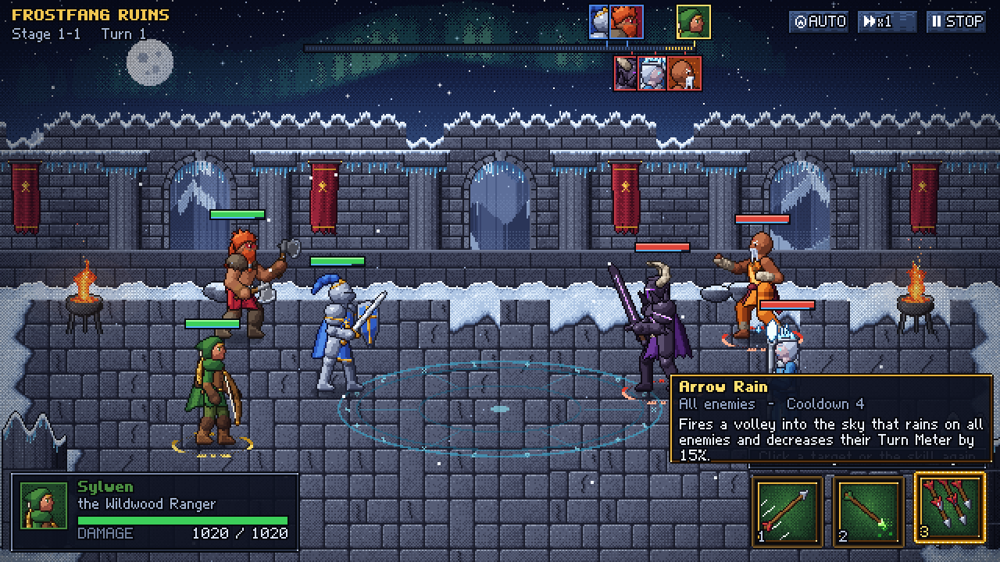
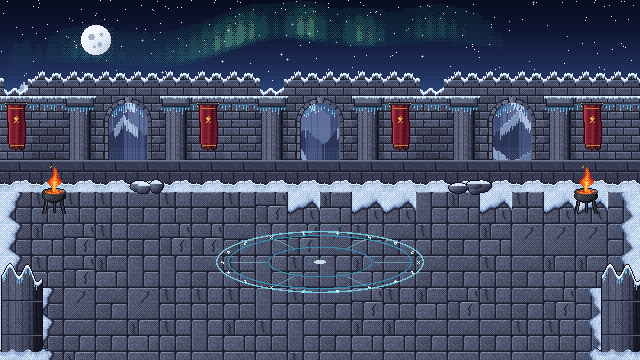

# Frostfang Ruins: an RSL / SWGOH-style battle in pixel art

A proof of concept for a turn-based hero battler in the style of **RAID: Shadow Legends** and **Star Wars: Galaxy of Heroes**, built to answer one question: *can it look good with 2D pixel art?*

Three heroes against three, a live turn meter, A1/A2/A3 skills with cooldowns, buffs and debuffs, enemy AI, auto battle and speed controls, in one hand-built zone. Every sprite, animation, effect, tile, icon and the font are **generated by code** in this repo (`npm run art`).




## Run it

```bash
npm install
npm run dev
```

Open http://localhost:5173. The sprite gallery (every animation, effect and icon) is at http://localhost:5173/gallery.html.

| Input | Action |
| --- | --- |
| click a skill, or `1` `2` `3` | select A1 / A2 / A3 (hover for the tooltip) |
| click a highlighted unit | use the skill on it; AoE and ally skills: click any target or the skill again |
| `Enter` / `Space` | confirm on the hovered or first valid target |
| `A`, `S`, `P` | auto battle, speed x1/x2/x3, pause |

URL options: `?seed=42` replays a battle, `?auto=1&speed=3` watches the AI fight, `?demo=whirlwind` loops one skill as a showcase (any skill id from the table below).

## The heroes

Every hero is 66-72 px tall on a 32 px tile grid, and has `idle`, `run`, three attacks, `hurt` and `death`. All of them are rendered for both facings, so the light always comes from the top-left.

| | Hero | Kit |
| --- | --- | --- |
|  | **Sir Aldric, the Lionguard** (player tank). Plate, kite shield, longsword. | **Valiant Strike** (`valiant_strike`): slash, may place DEF Down. **Shield Bash** (`shield_bash`): may Stun. **Aegis Oath** (`aegis_oath`): Shields + DEF Up on all allies, Taunts. |
|  | **Brakka Ironhide, the Berserker** (player damage). Two bearded axes, fur mantle. | **Rending Chop** (`rending_chop`): two chops. **Whirlwind** (`whirlwind`): spins through all enemies twice. **Skullsplitter** (`skullsplitter`): leap slam, executes below 50% HP, DEF Down. |
|  | **Sylwen, the Wildwood Ranger** (player damage). Hooded cloak, longbow. | **Swift Shot** (`swift_shot`). **Venom Arrow** (`venom_arrow`): kneeling shot, Poison + SPD Down. **Arrow Rain** (`arrow_rain`): volley on all enemies, -15% turn meter. |
|  | **Ysolde, the Frost Witch** (enemy control). Ice crown, crystal staff. | **Ice Shard** (`ice_shard`): may slow. **Blizzard** (`blizzard`): ice spikes under all enemies. **Glacial Prison** (`glacial_prison`): encases a hero in ice (Freeze). |
|  | **Vorhaal, the Dread Knight** (enemy bruiser). Horned helm, runeblade. | **Cursed Cleave** (`cursed_cleave`): may place ATK Down. **Soul Rend** (`soul_rend`): impale and drain life. **Dread Sweep** (`dread_sweep`): a wave of dread through all enemies, DEF Down. |
|  | **Master Tenzo, the Iron Fist** (enemy support). Bare-handed martial artist. | **Flurry of Fists** (`flurry`): three hits. **Serenity** (`serenity`): heals and cleanses allies, Regen. **Dragon Kick** (`dragon_kick`): flying kick, may Stun. |

Every attack moves the hero: melee heroes run to the target and back, ranged heroes advance to shoot, Whirlwind and Dread Sweep charge the middle of the enemy line, and Skullsplitter and Dragon Kick leap in an arc that lands exactly on the hit frame.

### Skill icons (A1 / A2 / A3, top to bottom)


## The zone

*Frostfang Ruins*: a snowed-in temple courtyard at night under an aurora, with braziers, banners and a glowing rune circle. It is built from 32 x 32 tiles; the arch openings are transparent so the painted mountains show through.



## Guiderails

The two documents that keep new content consistent:

- **[docs/ART_GUIDE.md](docs/ART_GUIDE.md)**: grid and scale, proportions, light, the master palette, shading and outline rules, animation timing, smears, effects, UI specs, environment and how to add a hero.
- **[docs/MECHANICS_GUIDE.md](docs/MECHANICS_GUIDE.md)**: turn meter math, turn structure, the skill schema, targeting and movement, damage, status effects, every kit, the AI, and the contract between the rules and the presentation.

## How the art is made

`tools/art` is a small procedural pixel-art studio:

1. **Rig** (`rig.ts`): a 2D skeleton with FK and 2-bone IK (feet stay planted, two-handed weapons stay in both hands). Poses are key frames; idle and run are parametric cycles.
2. **Shapes** (`parts.ts`, `heroes/*.ts`): tapered capsules, domes, bevelled polygons and ribbons build limbs, armour, cloth, capes and weapons.
3. **Renderer** (`render.ts`): rasterizes at native resolution with no anti-aliasing, lights every pixel from one top-left key light, quantizes into 6-step hue-shifted palette ramps, removes orphan pixels, then draws separation lines and coloured outlines.
4. **Smears, effects, tiles, icons, font** (`parts.ts`, `fx.ts`, `tiles.ts`, `ui.ts`, `font.ts`) follow the same palette and rules.
5. **Build** (`build.ts`): trims and packs every frame of both facings into atlases with hit-frame and event metadata.

The output is deterministic: running `npm run art` twice produces identical files.


## Project layout

```
src/
  engine/        640x360 screen with whole-number scaling, game clock (tweens, waits, hit-stop), bitmap font, particles
  game/data/     heroes, skills and status definitions (data-driven kits)
  game/battle/   pure rules: turn meter, skill resolution, statuses, AI  (unit tested)
  game/view/     battle scene and choreography, units, effects, HUD, zone renderer
tools/art/       the procedural art pipeline (writes public/assets and docs/images)
tools/shots.ts   headless screenshots and frame bursts of the running game (system Edge/Chrome)
tests/           rules tests (vitest) and a balance simulation
docs/            guiderails and images
```

## Scripts

| Command | What it does |
| --- | --- |
| `npm run dev` | start the game with hot reload |
| `npm run build` | type-check and build to `dist/` (game + gallery) |
| `npm test` | rules tests: turn order, shields, cooldowns, taunt, freeze, poison, healing, deaths, 40 full AI battles |
| `npm run art` | regenerate every asset in `public/assets` |
| `npm run typecheck` | type-check the game and the tools |
| `npx tsx tools/art/docsart.ts` | regenerate the README images and GIFs |
| `npx tsx tests/balance.sim.ts` | win rate and battle length over 500 seeded AI battles |

## Scope

This is a proof of concept for the look and the battle loop. Stats are placeholders, and there is one stage with no meta-game (collection, gear, progression).
