# Oathbound: an RSL / SWGOH-style hero battler in pixel art

A turn-based hero collector in the style of **RAID: Shadow Legends** and **Star Wars: Galaxy of Heroes**, built to answer one question: *can it look and play that well with 2D pixel art?* Every sprite, animation, effect, tile, backdrop, icon, the logo, the world map and the font are **generated by code** in this repo (`npm run art`), from one palette and one light.

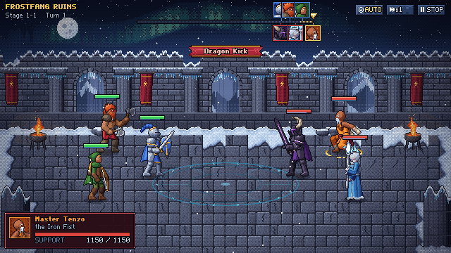

- **13 champions** in 7 factions, each with idle, run, three attacks, hurt and death (Anhotep also rises from the dead), rendered for both facings.
- **3 combat backgrounds**: the snowbound *Frostfang Ruins*, the sunset necropolis of the *Sunscar Ruins* and the afrofuturist *Nyota Skyforge* on the high plateau.
- **A campaign** of 10 stages in three chapters on a painted world map; every enemy you defeat can be **recruited** on the first clear.
- **A collection** of champions with locked silhouettes, rarities, affinities, factions and roles, and a detail page with every animation and skill.
- **The Academy**: an in-game codex that teaches combat, the turn meter, damage, affinities, all buffs, debuffs and special mechanics, with live demonstrations.
- **Real mechanics**: turn meter, A1/A2/A3 cooldowns, 16 statuses, affinity cycle, counterattacks, dispels, lifesteal, execute, turn meter boosts, Undying, Overdrive, bosses, stars, auto battle and speed controls.
- **Guardrails** that keep new content consistent: balance norms and a balance simulator, content tests, an art audit, and two project skills for adding champions and backgrounds.

| | |
| --- | --- |
| 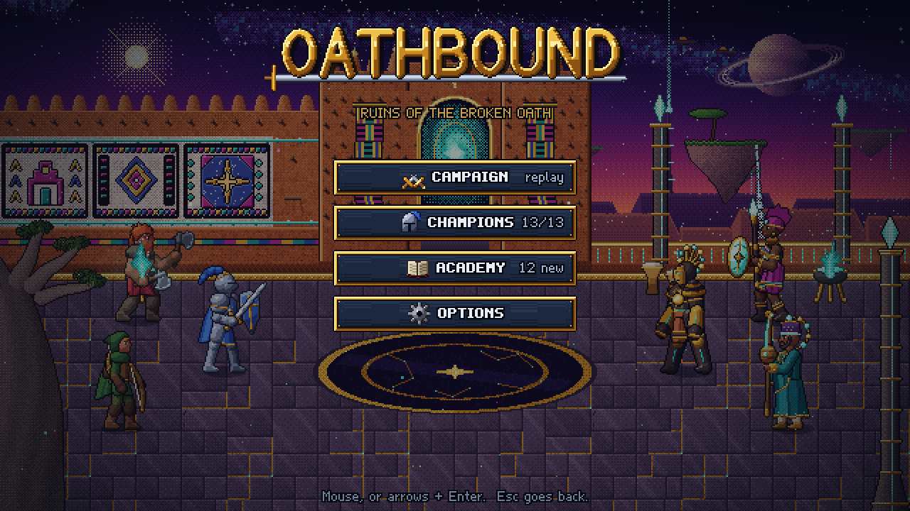 | 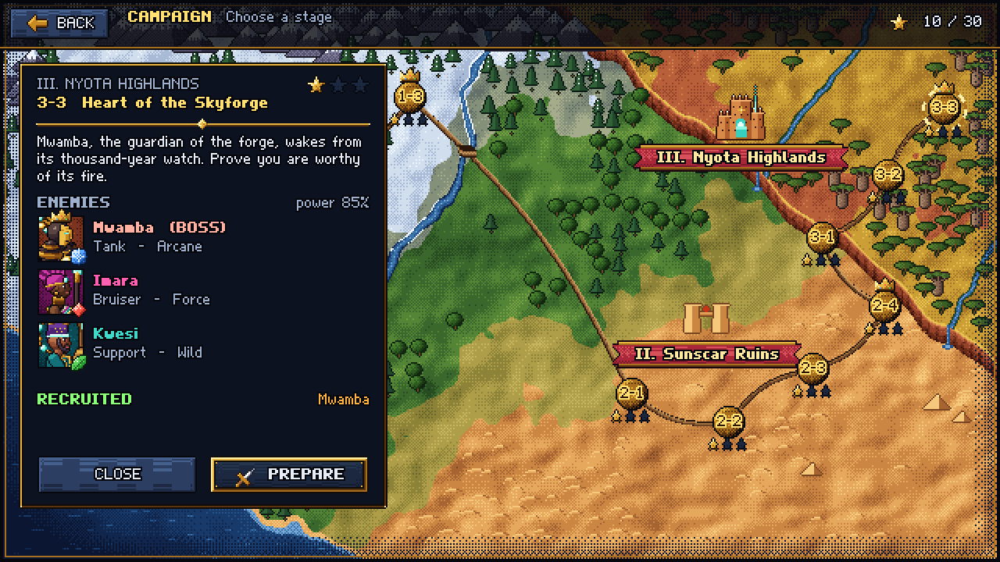 |
| 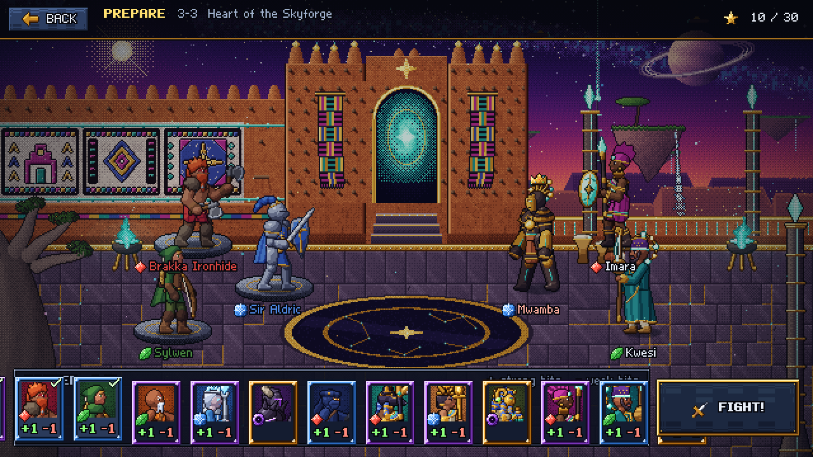 | 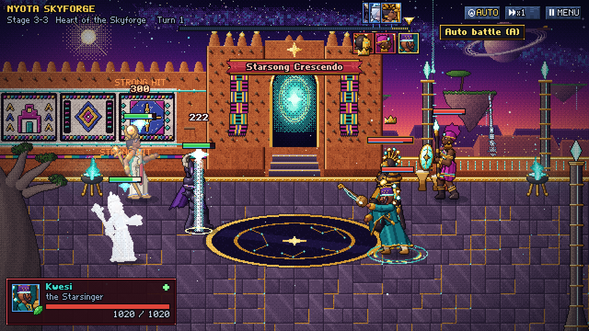 |
| 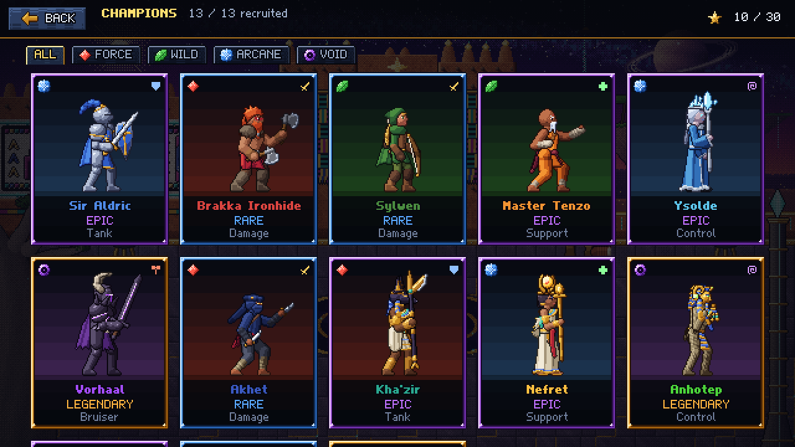 | 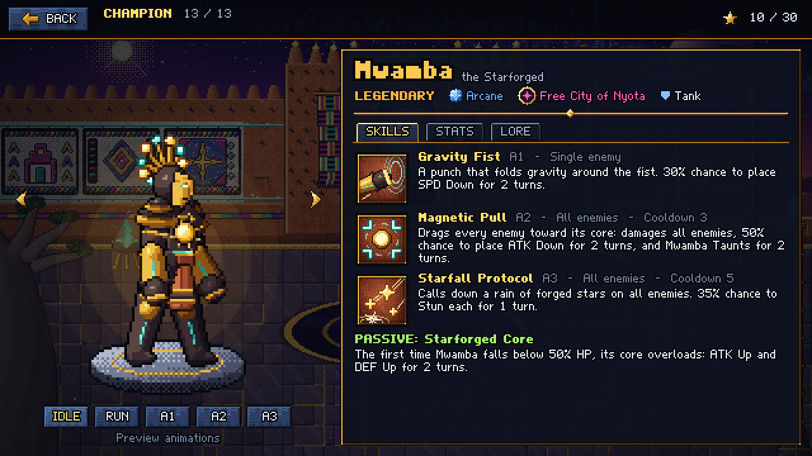 |
| 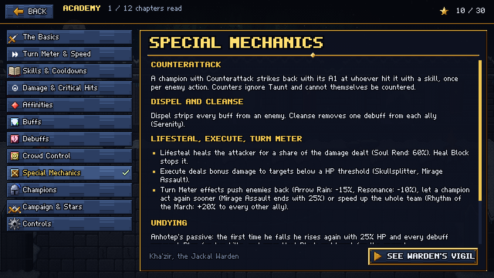 | 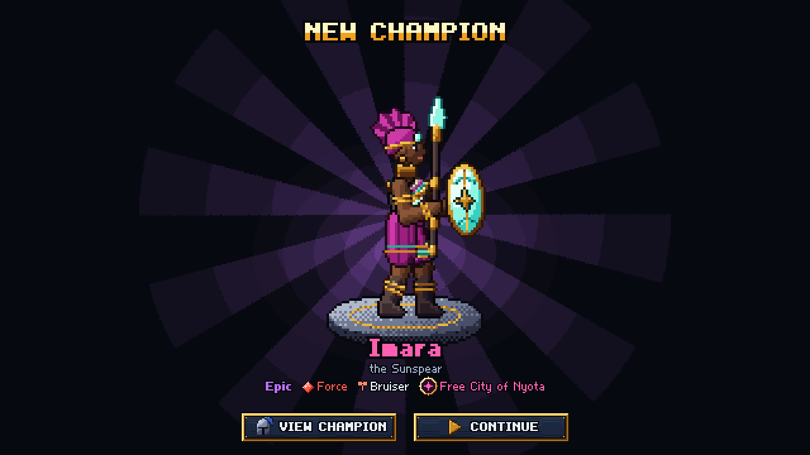 |

## Run it

```bash
npm install
npm run dev
```

Open http://localhost:5173. The sprite gallery (every animation, effect and icon) is at http://localhost:5173/gallery.html.

| Input | Action |
| --- | --- |
| mouse | everything: click skills, targets and buttons; hover anything for a tooltip |
| `1` `2` `3`, arrows, `Enter` | pick a skill, cycle targets, confirm |
| `A`, `S`, `Esc` | auto battle, speed x1/x2/x3, pause menu (and back in menus) |
| arrows + `Enter` in menus | move between buttons, activate |

Deep links: `?screen=campaign|team|battle|collection|champion|academy|options|recruit`, `&stage=3-3`, `&team=knight,monk,frostmage`, `&champion=colossus`, `&chapter=buffs`; `?demo=<skill_id>` loops one skill; `?unlockall=1`, `?progress=2-1` (clear up to a stage), `?reset=1`.

## The champions

| | Champion | Kit |
| --- | --- | --- |
| 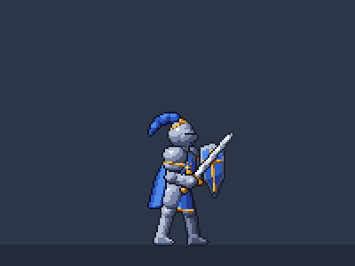 | **Sir Aldric, the Lionguard**. Epic Arcane Tank, Order of Dawn. Plate, kite shield, longsword. | **Valiant Strike**: may place DEF Down. **Shield Bash**: may Stun. **Aegis Oath**: Shields and DEF Up on all allies, Taunts. |
|  | **Brakka Ironhide, the Berserker**. Rare Force Damage, Clans of the North. Two bearded axes. | **Rending Chop**: two chops. **Whirlwind**: spins through all enemies twice. **Skullsplitter**: leap slam, executes below 50%. |
| 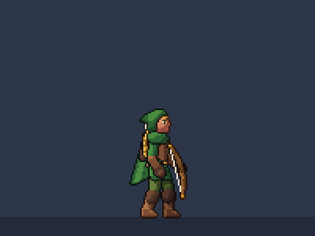 | **Sylwen, the Wildwood Ranger**. Rare Wild Damage, Wildwood. Longbow. | **Swift Shot**. **Venom Arrow**: Poison, may slow. **Arrow Rain**: volley on all enemies, -15% turn meter. |
| 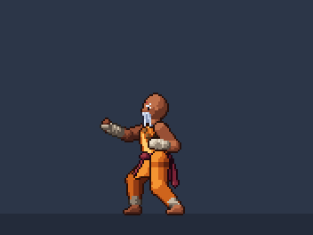 | **Master Tenzo, the Iron Fist**. Epic Wild Support, Temple of the Still Peak. | **Flurry of Fists**: three hits. **Serenity**: heals, cleanses, Regen. **Dragon Kick**: flying kick, may Stun. |
| 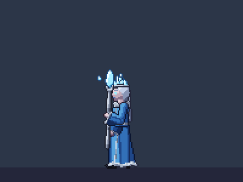 | **Ysolde, the Frost Witch**. Epic Arcane Control, Frostfang Coven. | **Ice Shard**: may slow. **Blizzard**: ice spikes under all enemies. **Glacial Prison**: Freeze. |
| 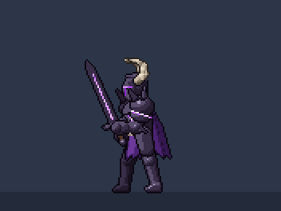 | **Vorhaal, the Dread Knight**. Legendary Void Bruiser, Frostfang Coven. Runeblade. | **Cursed Cleave**: may place ATK Down. **Soul Rend**: lifesteal. **Dread Sweep**: all enemies, DEF Down. |
| 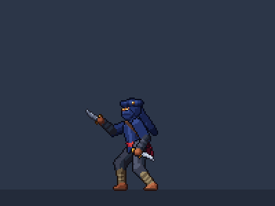 | **Akhet, the Dune Stalker**. Rare Force Damage, Sunscar Dynasty. Twin daggers. | **Twin Fangs**: two cuts, Poison per hit. **Scorpion Sting**: blinks behind the target, Heal Block and Weaken. **Mirage Assault**: four cuts from every side, execute, keeps 25% turn meter. |
| 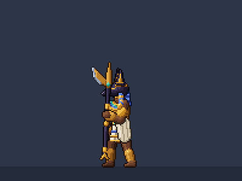 | **Kha'zir, the Jackal Warden**. Epic Force Tank, Sunscar Dynasty. Crescent glaive. | **Jackal's Bite**: may Weaken. **Warden's Vigil**: a howl gives all allies Counterattack, Taunts. **Weighing of Hearts**: strips every buff, then strikes. |
| 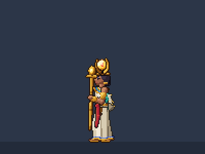 | **Nefret, the Sun Priestess**. Epic Arcane Support, Sunscar Dynasty. Wings of light. | **Solar Lance**: may Burn. **Blessing of Dawn**: heals all allies, ATK Up. **Wrath of the Sun**: pillars of sunfire, Heal Block, may Burn. |
| 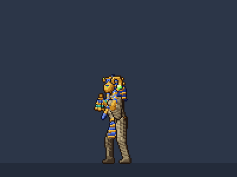 | **Anhotep, the Tomb Lord**. Legendary Void Control, Sunscar Dynasty. Crook and flail. | **Grave Touch**: may Poison. **Curse of Ages**: Weaken and slow all enemies. **Eternal Tomb**: seals a target in a golden sarcophagus (Stun, Heal Block). Passive **Undying**. |
| 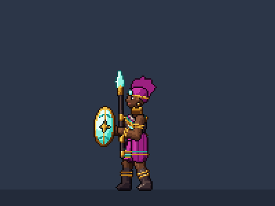 | **Imara, the Sunspear**. Epic Force Bruiser, Free City of Nyota. Gele headwrap, hard-light shield and spear. | **Sunspear Flurry**: two thrusts, may Shield herself. **Spiral of Spears**: spins through all enemies twice, may place DEF Down. **Sunfall Javelin**: leaps and hurls her spear, Weaken. |
| 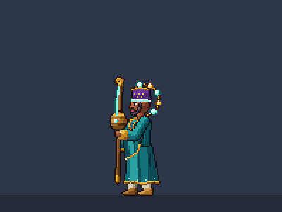 | **Kwesi, the Starsinger**. Rare Wild Support, Free City of Nyota. Griot with a kora-staff and a halo of star-orbs. | **Resonance**: a ring of sound, -15% turn meter. **Rhythm of the March**: +20% turn meter to every other ally, SPD Up, cleanses a debuff each. **Starsong Crescendo**: starlight on all enemies, heals all allies. |
| 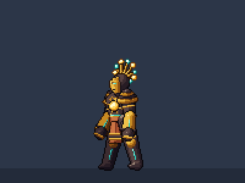 | **Mwamba, the Starforged**. Legendary Arcane Tank, Free City of Nyota. Guardian of the Skyforge with a sun core and a crest of rays. | **Gravity Fist**: may slow. **Magnetic Pull**: all enemies, may place ATK Down, Taunts. **Starfall Protocol**: forged stars on all enemies, may Stun. Passive **Overdrive**: below 50% HP its core overloads (ATK Up, DEF Up). |

### Skill icons (A1 / A2 / A3, one row per champion)


## The world

| Frostfang Ruins | Sunscar Ruins |
| --- | --- |
|  | 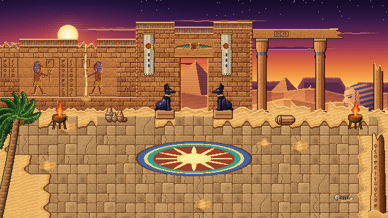 |
| A snowed-in temple courtyard at night under an aurora: braziers, banners, a glowing rune circle; the arches open onto the mountains. | A necropolis at sunset: offering reliefs, a pylon gate framing the great pyramid, jackal statues, a ruined colonnade before a toppled colossus, a sun mosaic, sand blowing in gusts, vultures and heat haze. |

| Nyota Skyforge |
| --- |
| 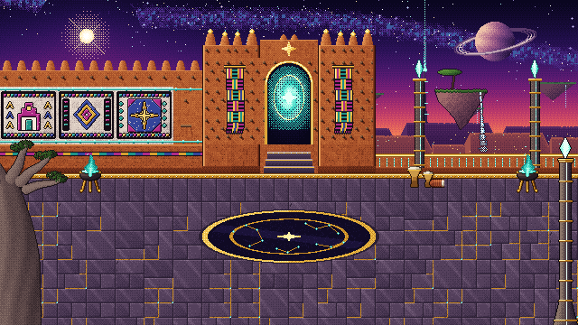 |
| The terrace of the star-smiths at cosmic dusk: a wall painted in bold geometric panels with circuits of hard light, a mud-brick gate tower with toron beams, kente banners and a star portal, light pylons over the void, floating islands with waterfalls, a sky-tower beam, a ringed world, plasma braziers, a star-map inlaid in the floor, drifting star-dust and shooting stars. |

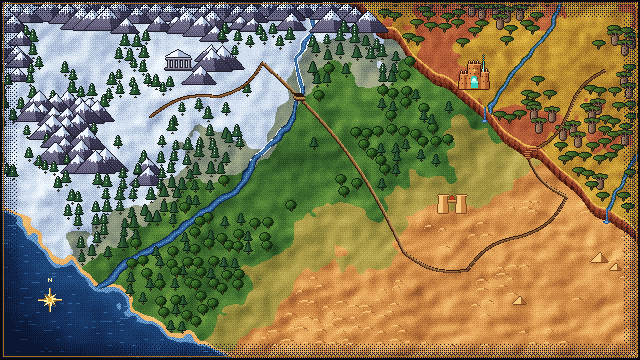

## Guiderails

| Document | What it fixes |
| --- | --- |
| [docs/ART_GUIDE.md](docs/ART_GUIDE.md) | grid and scale, proportions, light, palette, shading, outlines, animation, effects, UI parts, combat backgrounds |
| [docs/MECHANICS_GUIDE.md](docs/MECHANICS_GUIDE.md) | turn meter, skills, damage, affinities, every status and mechanic, every kit, the balance norms and the difficulty curve, the presentation contract |
| [docs/GAME_STRUCTURE.md](docs/GAME_STRUCTURE.md) | the content model: champions, categories, campaign, profile, screens and routes |
| [docs/UI_GUIDE.md](docs/UI_GUIDE.md) | screen layout, UI parts, colors, interaction and text rules |
| [.claude/skills/new-champion](.claude/skills/new-champion/SKILL.md) | step-by-step recipe, worksheet and templates for a new champion |
| [.claude/skills/new-combat-background](.claude/skills/new-combat-background/SKILL.md) | step-by-step recipe, worksheet and template for a new combat background |

The checks behind them: `npm test` (rules and content), `npm run balance` (stat budgets, kit norms, win-rate impact, campaign curve), `npm run audit` (palette, sizes, clipping, color budgets).

## How the art is made

`tools/art` is a small procedural pixel-art studio:

1. **Rig** (`rig.ts`): a 2D skeleton with FK and 2-bone IK. Poses are key frames; idle and run are parametric cycles.
2. **Shapes** (`parts.ts`, `champions/*.ts`): tapered capsules, domes, bevelled polygons and ribbons build limbs, armour, cloth, wings and weapons.
3. **Renderer** (`render.ts`): rasterizes at native resolution with no anti-aliasing, lights every pixel from one top-left key light, quantizes into 6-step hue-shifted palette ramps, removes orphan pixels, then draws separation lines and coloured outlines.
4. **Effects, zones, UI, map, font** (`fx/`, `zones/`, `ui/`, `map.ts`, `font.ts`) follow the same palette and light.
5. **Build** (`build.ts`): trims and packs every frame of both facings into atlases with hit-frame and event metadata. Deterministic: running it twice produces identical files.


## Project layout

```
src/
  engine/          640x360 screen with whole-number scaling, game clock, bitmap font, particles
  game/data/       champions, statuses, categories, campaign, zones, Academy text, balance norms
  game/battle/     pure rules: turn meter, skill resolution, statuses, counters, AI, simulator (unit tested)
  game/view/       battle scene and choreography, units, effects, HUD, zone renderer
  game/screens/    main menu, campaign, team select, battle, collection, champion, Academy, options, recruit
  game/ui/         the immediate-mode UI kit (buttons, panels, tooltips, keyboard focus)
tools/art/         the procedural art pipeline (writes public/assets and docs/images)
tools/balance.ts   the balance report
tools/shots.ts     headless screenshots and frame bursts of the running game
tests/             rules and content tests (vitest)
.claude/skills/    project skills: new champion, new combat background
```

## Scripts

| Command | What it does |
| --- | --- |
| `npm run dev` | start the game with hot reload |
| `npm run build` | type-check and build to `dist/` (game + gallery) |
| `npm test` | rules tests and content tests |
| `npm run balance` | balance report (`-- quick` for a faster, noisier run) |
| `npm run art` | regenerate every asset in `public/assets` (`-- champions <id>`, `-- zones <id>`, `-- fx`, `-- ui`, `-- map`) |
| `npm run audit` | art audit |
| `npm run typecheck` | type-check the game and the tools |
| `npx tsx tools/art/docsart.ts` | regenerate the README images and GIFs |
