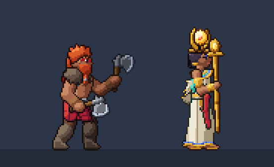
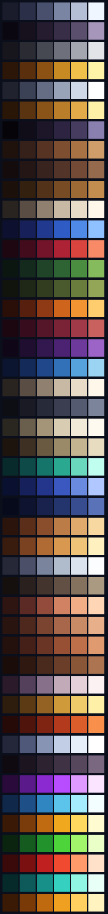
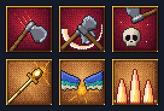
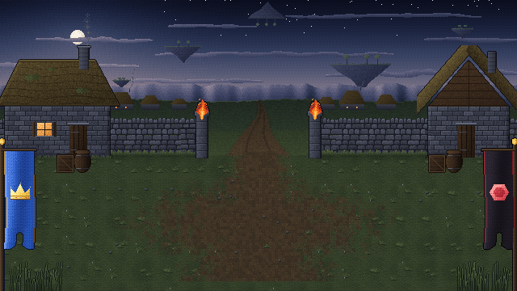

# Art Guiderails

This is the rulebook for every pixel in The Loom: Reliquary of Legends. Champions, effects, combat backgrounds, the world map, icons and UI parts are all **generated by code** (`tools/art/*`, run `npm run art`), and the generator enforces most of these rules automatically. `npm run audit` proves the rest. When you add art, follow the same rules so it sits next to the existing art without looking foreign.

**Direction:** high fantasy with a gothic arcane look. No science fiction, and no literal yarn or craft look: the Loom's threads, spools and patterns are arcane relics, never sewing things. The world is Jakub's ([DESIGN_DECISIONS.md](DESIGN_DECISIONS.md)): a realm broken by the fall of a celestial loom, floating islands, four factions with their standards. Today's champion bodies are proof-of-concept stand-ins, and Zone 1's background and the world map are a first take on his working notes; new art is proposed with previews and approved before it is built.

Step-by-step recipes live in the project skills: [new champion](../.claude/skills/new-champion/SKILL.md) and [new combat background](../.claude/skills/new-combat-background/SKILL.md).

---

## 1. Grid and screen

| Rule | Value |
| --- | --- |
| Tile | **32 x 32 px** |
| Virtual screen | **640 x 360** (20 x 11.25 tiles) |
| Scaling | whole numbers only (x2 = 1280x720, x3 = 1920x1080); letterbox the rest |
| Sub-pixel positions | never: everything is drawn at integer coordinates in the 640x360 buffer |
| Rotation / scaling of art | only inside the 640x360 buffer, never on the upscaled image (no "mixels"); the only 2x art is the champion showcase (detail page, recruit ceremony), drawn at exactly 2x |
| Smooth gradients, anti-aliased shapes | never; gradients are posterized bands or 4x4 Bayer dithering (`ui.bands`, `ui.glow`, `rampDither`) |

All art is authored at 1x. The game renders into a 640x360 canvas and the browser upscales it with nearest-neighbour filtering.

## 2. Champions

### 2.1 Size and frame box

| Rule | Value |
| --- | --- |
| Body height (feet to top of head/helmet) | **66-80 px**; the audit fails below **64** or above **96** (idle frame 0) |
| Sprite height incl. weapon/horns/ears at rest | 68-90 px |
| Frame box | **208 x 160 px** for every champion and every frame |
| Pivot | **(104, 140)**: the point between the feet on the ground |
| Facing | champions are generated for **both** facings (R and L); sprites are never mirrored at runtime |
| Ground plane | `death` and `rise` frames are clipped 8 px below the feet line (`GROUND_CLIP`), so capes and sashes rest on the floor |

The frame box is generous so a glaive at full extension or a falling body never clips; the audit fails any frame that touches its edges. The build trims each frame and packs it into an atlas with the offset of the trimmed rect, so empty space costs nothing.

### 2.2 Proportions (about 5 heads tall)

| Part | Size |
| --- | --- |
| Head | 13-15 px tall (animal heads may run longer) |
| Neck to pelvis (torso) | 19.5-22.5 px |
| Legs (hip to ankle) | 31-34 px, slight knee bend at rest |
| Arms | upper 12-13.5, forearm 11-12.5, fist radius ~3 |
| Shoulder width in 3/4 view | 16-20 px including pauldrons |

Heroic stylisation: slightly large head and hands for readability, broad shoulders for warriors, slim silhouettes for casters and rogues.

### 2.3 View and layering

- **3/4 side view**, facing the enemy line. The near side of the body faces the camera.
- **Near limbs** are drawn in front of the torso. **Far limbs** are drawn behind it and shaded **one ramp step darker** (`shade: -1`).
- A shield or second weapon on the far arm sits between the torso and the near arm, so the near (weapon) arm always reads on top.
- Capes, manes, wings and quivers sit behind everything; tabards, aprons and kilts sit between the legs.
- Long robes and dresses use `robe()` (`parts.ts`): standing, the cloth hangs straight down with the hem just off the ground; once the wearer tips over (torso under 55 degrees: falling, lying dead) it follows the legs, so it never smears along the floor or leaves the feet behind. Anything else that hangs (sashes, tassels) hangs the same way as the robe.
- Feet stay on the floor: a kneeling back foot rests on its toes, heel up; only a weapon striking or planted may go below the feet line.

### 2.4 Silhouette and hue

Every champion must be recognisable from a solid black silhouette (the collection shows locked champions exactly that way). Each one owns a unique silhouette feature and a signature hue that the skill icons, card window and `color` in its data share:

| Champion | Silhouette feature | Signature hue |
| --- | --- | --- |
| Azure Warrior (stand-in body: the proof of concept's berserker) | wild mane and braided beard, two bearded axes, fur mantle | crimson + grey-brown fur |
| Sanguine Support (stand-in body: the proof of concept's sun priestess) | sun-disc crown between horns, wings of light, staff | linen white + gold + lapis |

Neither body is designed: they stand in until Jakub decides the art of the two champions. Their `color` in the data follows their faction's standard (Azure Crown blue, Sanguine Dominion red), not the stand-in body. Within one faction no two champions share a hue family; across factions the material language should separate them, and the standards give the first cue: the Azure Crown is blue with a crown, the Sanguine Dominion black with a red hexagon ([DESIGN_DECISIONS.md](DESIGN_DECISIONS.md) 3.6). Faction and affinity are independent: the blue Azure Crown starter is Ember, the black-and-red Sanguine Dominion support is Tide, on purpose.

## 3. Light

- **One key light for the whole game**: from the **top-left, slightly in front** (`LIGHT_DIR = normalize(-0.5, -0.65, 0.58)` in screen space).
- Every backdrop places its light source in the upper-left to justify it: the veiled dusk sun over the dim island of Zone 1. Tiles are lit the same way (top/left edges bright, bottom/right edges dark), and so are carvings: in sunk relief the upper-left lip of a cut is in shadow and the lower-right wall catches the light.
- Because the light must stay top-left, sprites are **rendered** for both facings instead of mirrored. A mirrored sprite would light its right side.
- Runtime light only adds: additive glow pools around fires (`ZoneDef.glow`), a mood tint (`ZoneDef.tint`), and unit shadows offset away from the light (`ZoneDef.shadow`: a low sun throws them longer and further right).

## 4. Palette

Every pixel comes from `tools/art/palette.ts`:

| Table | What | Used by |
| --- | --- | --- |
| `MAT` | 6-step material ramps `[outline, deep, shadow, base, light, highlight]` | champions, props drawn with the champion renderer, menu glyphs |
| `ACCENT`, `INK` | single colors for decals, smears, eyes, glyph details | champions, icons |
| `FXR` | 5-step effect ramps, dark edge to white-hot core | combat effects |
| `UIR` | interface ramps: gold, navy, steel, stone, rarity and affinity ramps | UI parts, card frames, gems |

Zones declare their own ramps at the top of their module (sky, stone, sand...), because a background is one painting with its own light; the audit holds them to a color budget instead.

| Index | Use |
| --- | --- |
| outline | 1px silhouette outline and separation lines; never pure black |
| deep | occlusion and far-side core shadow |
| shadow | form shadow |
| base | the local color, what the material "is" |
| light | planes facing the key light |
| highlight | specular sparkle on metal, brightest accents; use sparingly |

**Hue shifting**: shadows move toward blue/violet, highlights toward warm yellow. Never darken a color by just lowering its brightness.

**Champion modules contain no color literals.** `npm run audit` fails a `hex('#...')` or `'#rrggbb'` in `tools/art/champions/*.ts` and any atlas pixel that is not in `MAT`, `ACCENT` or `INK`. Need a new material? Add a 6-step ramp to `MAT` (keep the hue shifting).

Material kinds decide how light quantizes into the ramp (`BANDS` in `palette.ts`): `matte, cloth, skin, hair, fur, metal, glow`. Metal gets a single-pixel specular highlight; glow materials are unlit and get a colored halo instead of a dark outline.

## 5. Shading

- **Cel bands, no gradients** on characters: the renderer computes a normal per pixel (tubes for limbs, domes for heads, bevels for plates and cloth), takes `n . L`, and snaps it to the material's ramp.
- **No dithering on characters.** Dithering (4x4 Bayer) is for the sky, backdrops, sand and snow, light pools, effects and icon backgrounds.
- **No orphan pixels**: a shade pixel with no same-shade neighbour inside its shape adopts the majority shade (cleanup pass). Deliberate single-pixel highlights are exempt.
- Cloth folds, wraps, bark and scale armour come from per-material texture functions (`tex`), never noise.

## 6. Outlines

- **1px outline around the silhouette**, colored with the outline entry of the material it touches (colored, never black).
- **Separation lines** where one form overlaps another: the pixels of the form behind get the outline color (`strong`) or two ramp steps darker (`soft`, for plate layers and folds).
- Joined parts of the same limb are one group and never get a line between them.
- Glowing parts (crystals, runes, eyes, gems) get a halo in their own deep color instead of a dark outline.

## 7. Animation

### 7.1 Required set per champion

| Animation | Frames | Timing | Notes |
| --- | --- | --- | --- |
| `idle` | 6-8 | 130-160 ms | whole-pixel breathing (1px), cloth/hair sway; desynchronised per unit |
| `run` | 8 | 65-85 ms | used to approach a target and to return; cape and hair stream back |
| `attack1` | 6-10 | see below | A1 |
| `attack2` / `skill` | 7-11 | | A2 (`skill` = in-place cast, also the victory pose) |
| `attack3` | 8-12 | | A3 |
| `hurt` | 3 | 90-110 ms | lean back, head snaps |
| `death` | 6 | 110-220 ms, last frame 600 ms | kneel, fall, lie still; the game fades it out |
| `rise` | 6 | | only for champions with Undying: the death played backwards, then stand |

The content tests fail when an animation a skill names is missing, and when the animation's number of hit frames differs from the skill's `hits`.

### 7.2 Attack structure

1. **Anticipation** (1-2 frames, the longest, 130-220 ms): wind up away from the target.
2. **Strike** (1 frame, 50-70 ms): the weapon has already travelled, a **smear** shows the path. This is the **hit frame**.
3. **Follow-through** (1-2 frames, 90-260 ms): overshoot, hold the pose so the impact reads.
4. **Recovery** (2 frames): blend back to idle.

| Event | Meaning |
| --- | --- |
| hit frame (`hit: true`) | damage numbers, hurt reactions and impact effects fire here (one per `hits` entry of the skill) |
| `shoot` | a projectile leaves the bow or staff (and Arrow Rain's volley) |
| `jump` | leap take-off; the game moves the champion in an arc that lands exactly on the next hit frame |
| `cast` | spell flash moment; plays the skill's `actorFx` at the head (a howl, a flare) |
| `turn` pose channel | flips the facing for one frame (spins, Mirage Assault) |

### 7.3 Smears

Weapon smears are crescents drawn between the previous and current weapon angle: **thick at the leading edge, tapering to a hairline at the trailing end**, white rim outside, the champion's tint inside (`smearSteel`, `smearGold`, `smearViolet`... in `ACCENT`). They sit behind the body and never exceed ~200 degrees of travel.

## 8. Effects (`tools/art/fx/`)

- `kit.ts` holds the shared vocabulary: crescents, cuts, bursts, sparks, rings, shards, flames, motes, glyph stamps, crossed blades. `common.ts` holds the original effects, `sunscar.ts` the desert ones, `nyota.ts` the hard light, sound and starfire of the plateau; `index.ts` merges them. New champions add their effects to the module of their faction.
- Every effect uses `FXR` ramps ending in a near-white core.
- 40-80 ms per frame; impacts are 5-8 frames, set pieces up to 12 (the sarcophagus), looping cues (stun stars, cast circles, projectiles) loop.
- Each effect has an **anchor**: chest-level impacts are centered (`ay 0.5`), ground effects are anchored at the feet (`ay 0.9-1.0`); the battle places any effect with `ay > 0.8` on the target's feet automatically.
- Nothing is cut off by its box. An effect that grows past it (rings at the feet, spikes, bursts, sparks) gets room with `pad: [top, right, bottom, left]`: the drawing keeps its own coordinates, and the built box and anchor include the room, so the effect lands on the same spot. `npm run audit` fails any frame that runs into its box edge, and padding that would move a ground effect's anchor to 0.8 or below.
- Beams from the sky (holy light, sunfire) dissolve toward the top with dithering instead of ending in a straight line.
- Draw layers: `ground` (cast circles, cracks, shockwaves), `world` (depth-sorted with units: ice spikes), `top` (slashes, beams, pillars, numbers).
- Additive blending only for light (holy beams, heal sparkles, hit stars, fire bursts, the revive helix). Solid effects (ice, sand, smoke, the sarcophagus) are drawn normally.
- Hit effects are designed facing right; the battle flips them when the attacker faces left.

## 9. UI (`tools/art/ui/`)

| Element | Spec |
| --- | --- |
| Font | one hand-drawn pixel family (`tools/art/font.ts`) in four faces. `regular`: caps 7 px, x-height 5, descenders 2 (cell 9 px). `bold`: the same letters redrawn with 2 px stems, so the counters of m, w, M and W stay open. `display`: the title face, caps 13 px drawn at full size (cell 18 px, two body cells), capitals only, for titles, champion names in headers and ceremonies, cooldowns and critical hits. `micro`: 3x5 digits in the same rounded shapes, for the turn counters on 12 px status icons. Text is never scaled up from the body faces; only the display face is drawn at 2x (battle titles, results). Titles take a two-tone fill (lower half of the capitals) |
| Logo | approved 2026-10-08: a gothic rose window (six gold lobes in a ring, each holding an arcane jewel as the Weaver Matrix holds six spools, a seventh at the centre) before THE LOOM. Letters and tracery are strokes rasterized and shaded as cast gold (lit bevel top-left, dark bevel bottom-right, hard face bands), with a drop shadow; 271 x 58 px. The subtitle RELIQUARY OF LEGENDS is text in the `display` face between two dividers, drawn by the main menu |
| Matrix rose | **144 x 144** (`tools/art/ui/matrix.ts`): the outer ring and the fixed slots in cast gold, the choice slots rimmed in arcane metal; the fixed triangle as gold rods, the choice triangle as a thread of arcane light; dark dithered wells for six slots and the centre. Shares `castMetal` with the logo |
| Spool | **18 x 18**: a crystal capsule holding a spiral thread of light, a relic and never a reel of yarn. Cap metal by grade: ebony (Ashen), silver, gold (Gilded); the thread's ramp by pattern; the glass glows in the thread's colour so the spool reads at 1x |
| Skill icon | **40 x 40**, 2px gold bevel frame, radial dithered background in the champion's `iconBg` ramp, glyph rendered with the champion renderer (an icon's glaive is the glaive the champion holds) |
| Status icon | **12 x 12**, buff = blue rim, debuff = red rim, 8x8 symbol, optional up/down badge or a second strike-through glyph (Heal Block) |
| Card frames | 24x24 nine-slice per rarity (`UIR.rarity`, base color = the rarity color in `meta.ts`), transparent center; `card_locked` in stone |
| Gems | 11x11, one cut per affinity so color is never the only cue: Ember diamond (red), Bloom leaf (green), Tide round with a glint (blue) |
| Emblems, roles | 15x15 faction medallions in a gold rim, after the standards (DESIGN_DECISIONS.md 3.6): the Azure Crown a gold crown on blue, the Sanguine Dominion a red hexagon on black, the Court of Root a brown claw on green (a 9x9 charge, lit on its upper-left edge), the Ashveil Reign a white bone across a dark grey. 9x9 role glyphs: Tank, Damage, Support |
| Panels, buttons | nine-slices: panels 6 px corners, big buttons 8 px, HUD buttons 4 px |

Screen layouts and interaction rules: [UI_GUIDE.md](UI_GUIDE.md).

## 10. Combat backgrounds (`tools/art/zones/`)

A zone is one module exporting a `ZoneArt` (contract in `zones/shared.ts`):

| Part | Rule |
| --- | --- |
| Backdrop | 640 x 200 painting: sky with the key light in the upper-left, then distant land; `horizon` marks where land meets sky (heat haze, mist) |
| Rows | 0-1 sky, **2-5 the back wall**, **6-11 the floor** where units stand |
| Tiles | 32 x 32, **seamless by construction**: stones put their joints on the right and bottom edges and their bevel light on the top and left |
| Openings | gates, arches and colonnade gaps are transparent so the backdrop shows through; put something worth seeing behind them |
| Props | sprites with a `PropKind`: `static`, `loop` (cycles frames), `pulse` (frame 1 breathes over frame 0), optional `fire` (flame, embers and a light pool) |
| Layers | `back` (on the wall), `floor` (under units), `fg` (in front of everything, keep to the screen edges) |
| Value | the floor is mid value and low contrast so outlined champions always pop; reserve the brightest values for sky and sparkle |
| Budget | backdrop at most 220 colors, tileset at most 160 (`npm run audit`) |

Runtime behaviour lives in `src/game/data/zones.ts` (`ZoneDef`): ambience (`snow`, `sand` or `motes`: drifting star-dust plus shooting stars behind the architecture), glow color of fires, ember colors (`embers`, default firelight), shadow offset and stretch, mood tint, birds (any flying sprite named `bird`: vultures, sky-skiffs), heat haze. `homeZone()` picks a faction's background for its Academy demos and champion dioramas.

| A Dim Island (`zone1.ts`) |
| --- |
|  |

Zone 1, a first take on Jakub's working notes (open sky, a dim island, a small settlement, two worlds touching): the green at the edge of the settlement, a dry-stone wall with a gap where the path leaves for the island's edge, cottages with lit windows, fire baskets on the gateposts, the two standards framing the field in the foreground, other islands drifting in a dusk sky (one upside down) over a sea of cloud. The kind of settlement (village, ruin, outpost or camp) is still open in the notes.

Floor tiles repeat across the arena, so a crack or a stain painted into a common variant repeats everywhere: keep damage to one rarely placed variant, and keep organic floors seamless by sharing one base field across variants and fading each variant's own detail in away from the tile border (`grass()` in `zone1.ts`). Large ground features (a worn path, a trampled patch) are `floor` props, not tiles.

## 11. Files and naming

| Asset | File | Key format |
| --- | --- | --- |
| Champion atlas | `public/assets/champions/<id>.png/.json` | `R/attack1/3` = facing / animation / frame |
| Effects | `public/assets/fx/fx.png/.json` | `anims.<name>.frames[i]` |
| Zone | `public/assets/zones/<id>/tiles.png, backdrop.png, props.png, zone.json` | tile ids index `zone.json:tiles`, props by `kinds` |
| World map | `public/assets/map/world.png` (1280x360), `overview.png` (640x180) | one generator renders both from the same geography (a 640x180 design sheet): Zone 1's island floating over a sea of cloud, seen from above at a slant, its settlement, field walls, trees and the two standards at the first stage; surface detail is drawn in each render's own pixels, never scaled; stage nodes, the road and the settlement's place come from `campaign.ts` |
| UI | `public/assets/ui/ui.png/.json, font.png/.json` | `icons.<skillId>`, `status.<statusId>`, `parts.<name>`, `portraits.<championId>` |

Frame rects are `[x, y, w, h, ox, oy]` where `ox, oy` is the trimmed rect's offset inside the 208x160 frame box.

## 12. Tools

| Command | What |
| --- | --- |
| `npm run art` | build everything (`-- champions <id>`, `-- zones <id>`, `-- fx`, `-- ui`, `-- map`) |
| `npm run audit` | palette, heights, frame-box clipping, literals, zone color budgets, effects cut off by their box, icon sizes |
| `npx tsx tools/art/preview.ts <id> 2 out.png all both` | contact sheet of every animation, both facings |
| `npx tsx tools/art/lineup.ts out.png 3` | every champion side by side |
| `npx tsx tools/art/fxpreview.ts out.png 2 name,name` | effect frames |
| `npx tsx tools/art/zoom.ts <id> <anim> <frame> out.png 9` | one frame cropped and enlarged: faces, trims, small props |
| `npx tsx tools/art/iconpreview.ts <id>[,<id>] out.png 6` | a champion's three skill icons, enlarged |
| `npx tsx tools/art/measure.ts [<id> <anim>]` | standing heights; with an animation, hand positions at hit frames (for `muzzle`) |
| `npx tsx tools/art/uipreview.ts out.png 3 [prefix]` | UI parts and status icons |
| `npx tsx tools/art/review.ts <id> out.png 2 [right\|left\|both] [anim,anim]` | every animation as a row, frames cropped tight, hit (red) and event (cyan) ticks: the sheet to review a champion with |
| `npx tsx tools/art/groundcheck.ts` | frames with pixels below the floor line (feet, robes or gear sinking through it) |
| `npx tsx tools/art/framediff.ts save\|diff <dir> <id,id>` | snapshot every frame, then list the frames a change touched: proves a refactor changes only what it means to |
| `npx tsx tools/art/fxcheck.ts` | effect frames cut off at their box edge (the audit's rule) |
| `npx tsx tools/art/fxzoom.ts <name> out.png 4 [frames]` | effect frames inside an outline of their box, with the anchor marked |
| `gallery.html` | every animation, effect and icon looping in the browser |
