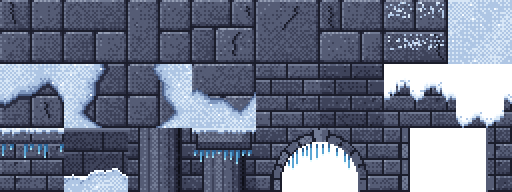

# Art Guiderails

This is the rulebook for every pixel in the project. The heroes, effects, tiles, icons and UI are all **generated by code** (`tools/art/*`, run `npm run art`), and the generator enforces most of these rules automatically. When you add new art, follow the same rules so it sits next to the existing art without looking foreign.


---

## 1. Grid and screen

| Rule | Value |
| --- | --- |
| Tile | **32 x 32 px** |
| Virtual screen | **640 x 360** (20 x 11.25 tiles) |
| Scaling | whole numbers only (x2 = 1280x720, x3 = 1920x1080); letterbox the rest |
| Sub-pixel positions | never: everything is drawn at integer coordinates in the 640x360 buffer |
| Rotation / scaling of art | only inside the 640x360 buffer, never on the upscaled image (no "mixels") |

All art is authored at 1x. The game renders into a 640x360 canvas and the browser upscales that canvas with nearest-neighbour filtering.

## 2. Heroes

### 2.1 Size and frame box

| Rule | Value |
| --- | --- |
| Body height (feet to top of head/helmet) | **66-72 px** (minimum 64) |
| Sprite height incl. weapon/horns at rest | 68-85 px |
| Frame box | **192 x 144 px** for every hero and every frame |
| Pivot | **(96, 134)**: the point between the feet on the ground |
| Facing | heroes are generated for **both** facings (R and L); sprites are never mirrored at runtime |

The frame box is generous so a greatsword at full extension or an overhead swing never clips. The build trims each frame and packs it into an atlas, storing the offset of the trimmed rect, so empty space costs nothing.

### 2.2 Proportions (about 5 heads tall)

| Part | Size |
| --- | --- |
| Head | 13-15 px tall |
| Neck to pelvis (torso) | 19.5-22.5 px |
| Legs (hip to ankle) | 31-33 px, slight knee bend at rest |
| Arms | upper 12-13.5, forearm 11-12.5, fist radius ~3 |
| Shoulder width in 3/4 view | 16-20 px including pauldrons |

Heroic stylisation: slightly large head and hands for readability, broad shoulders for warriors, slim silhouettes for casters and rangers.

### 2.3 View and layering

- **3/4 side view**, facing the enemy line. The near side of the body faces the camera.
- **Near limbs** (arm/leg closer to the camera) are drawn in front of the torso. **Far limbs** are drawn behind it and shaded **one ramp step darker**.
- A shield carried on the far arm sits between the torso and the near arm, so the near (weapon) arm always reads on top.
- Capes, manes and quivers sit behind everything; tabards and skirts sit between the legs.

### 2.4 Silhouette rules

Every hero must be recognisable from a solid black silhouette. Each one owns a unique silhouette feature and a unique signature hue:

| Hero | Silhouette feature | Signature hue |
| --- | --- | --- |
| Sir Aldric (Knight) | plumed helm, kite shield, longsword | royal blue + gold |
| Brakka (Warrior) | wild mane and braided beard, two bearded axes, fur mantle | crimson + grey-brown fur |
| Sylwen (Archer) | pointed hood, longbow, quiver | forest green + leather |
| Ysolde (Frost Mage) | ice crown, floor-length robe, crystal staff | ice blue + cyan glow |
| Vorhaal (Dread Knight) | ivory horns, spiked pauldrons, two-handed runeblade | black steel + violet glow |
| Master Tenzo (Monk) | bald head, drooping white moustache, baggy pants | saffron + maroon |

Player heroes cover blue / red / green, enemies cover cyan / violet / orange, so no two heroes share a hue family.

## 3. Light

- **One key light for the whole game**: from the **top-left, slightly in front** (`LIGHT_DIR = normalize(-0.5, -0.65, 0.58)` in screen space).
- The moon in the backdrop sits in the upper-left to justify it, and the environment tiles are lit the same way (top/left edges bright, bottom/right edges dark).
- Because the light must stay top-left, sprites are **rendered** for both facings instead of mirrored. A mirrored sprite would light its right side.
- Warm local light (braziers) is added at runtime as an additive glow; it never changes the baked shading.

## 4. Palette

Every pixel comes from `tools/art/palette.ts`. A material is a **ramp of 6 colors**:

```
[outline, deep, shadow, base, light, highlight]
```

| Index | Use |
| --- | --- |
| outline | 1px silhouette outline and separation lines; never pure black |
| deep | occlusion and far-side core shadow |
| shadow | form shadow |
| base | the local color, what the material "is" |
| light | planes facing the key light |
| highlight | specular sparkle on metal, brightest accents; use sparingly |

**Hue shifting**: shadows move toward blue/violet, highlights toward warm yellow. Never darken a color by just lowering its brightness.


Materials (top to bottom in the swatch above): `steel, darksteel, iron, gold, silver, leather, darkleather, wood, bone, blue, red, green, moss, saffron, maroon, violet, ice, wrap, charcoal, furWhite, furBrown, skinLight, skinTan, skinBrown, skinPale, hairBlonde, hairGinger, hairSilver, hairDark, glowViolet, glowIce, glowGold, glowGreen, glowRed, glowCyan`.

Material kinds decide how light quantizes into the ramp (`BANDS` in `palette.ts`): `matte, cloth, skin, hair, fur, metal, glow`. Metal gets a single-pixel specular highlight; glow materials are unlit and get a colored halo instead of a dark outline.

## 5. Shading

- **Cel bands, no gradients** on characters: the renderer computes a normal per pixel (tubes for limbs, domes for heads and pauldrons, bevels for plates and cloth), takes `n . L`, and snaps it to the material's ramp.
- **No dithering on characters.** Dithering (4x4 Bayer) is allowed for the sky, backdrop, light pools, effects and icon backgrounds.
- **No orphan pixels**: a shade pixel with no same-shade neighbour inside its shape adopts the majority shade (cleanup pass). Deliberate single-pixel highlights are exempt.
- Cloth gets fold lines (one ramp step down) and fur gets broken texture; both come from per-material texture functions, not noise.

## 6. Outlines

- **1px outline around the silhouette**, colored with the outline entry of the material it touches (sel-out ready: colored, never black).
- **Separation lines** where one form overlaps another (arm over torso, near leg over far leg): the pixels of the form behind get the outline color (`strong`) or two ramp steps darker (`soft`, used for plate layers and folds).
- Joined parts of the same limb (upper arm and forearm) are one group and never get a line between them.
- Glowing parts (crystals, runes, eyes) get a halo in their own deep color instead of a dark outline.

## 7. Animation

### 7.1 Required set per hero

| Animation | Frames | Timing | Notes |
| --- | --- | --- | --- |
| `idle` | 6-8 | 130-160 ms | whole-pixel breathing (1px), cloth/hair sway; desynchronised per unit |
| `run` | 8 | 70-85 ms | used to approach a target and to return; cape and hair stream back |
| `attack1` | 7-10 | see below | A1 basic attack |
| `attack2` / `skill` | 7-11 | | A2 |
| `attack3` / `skill` | 8-12 | | A3 |
| `hurt` | 3 | 90-110 ms | lean back, head snaps |
| `death` | 6 | 110-220 ms, last frame 600 ms | kneel, fall, lie still, then the game fades it out |

### 7.2 Attack structure

Every attack follows the same rhythm:

1. **Anticipation** (1-2 frames, the longest, 130-220 ms): wind up away from the target.
2. **Strike** (1 frame, 50-70 ms): the weapon has already travelled, a **smear** shows the path. This is the **hit frame**.
3. **Follow-through** (1-2 frames, 90-260 ms): overshoot, hold the pose so the impact reads.
4. **Recovery** (2 frames): blend back to idle.

Hit frames and named events are stored in the atlas JSON and drive gameplay timing:

| Event | Meaning |
| --- | --- |
| hit frame | damage numbers, hurt reactions and impact effects fire here (one per `hits` entry of the skill) |
| `shoot` | a projectile leaves the bow or staff |
| `jump` | leap take-off; the game moves the hero in an arc that lands exactly on the next hit frame |
| `cast` | spell flash moment (rune circles, glows) |

### 7.3 Smears

Weapon smears are crescents drawn between the previous and current weapon angle: **thick at the leading edge, tapering to a hairline at the trailing end**, white rim outside, the hero's tint inside (`steel: white/pale blue`, `axes: white/peach`, `runeblade: lilac/violet`). They sit behind the body and never exceed ~200 degrees of travel.

## 8. Effects

- Same ramps as everything else: every effect has a 5-step ramp ending in a near-white core (`steel, fire, violet, gold, ice, green, chi, dust, smoke`).
- 45-80 ms per frame; impacts are 5-6 frames, persistent effects (stun stars, cast circles) loop.
- Each effect has an **anchor**: chest-level impacts are centered (`ax 0.5, ay 0.5`), ground effects are anchored at the feet (`ay 0.9-1.0`).
- Three draw layers: `ground` (under units: cast circles, cracks, shockwaves), `world` (depth-sorted with units: ice spikes), `top` (over everything: slashes, beams, numbers).
- Additive blending only for light (holy beams, heal sparkles, hit stars). Solid effects (ice, smoke, cracks) are drawn normally.

## 9. UI

| Element | Spec |
| --- | --- |
| Font | custom pixel font: caps 7 px, x-height 5, descenders 2 (cell 9 px). `bold` variant (1px dilation) for numbers and titles; titles are bold at x4 with a two-tone fill |
| Skill icon | **40 x 40**, 2px gold bevel frame, background is a radial dithered gradient of the hero's signature ramp, the glyph is rendered with the same shaded-primitive renderer as the heroes (a sword on an icon is the same sword the knight holds) |
| Skill slot | 48 x 48 frame around the icon: `idle` bronze, `selected` gold with a running sparkle, `disabled` grey with the cooldown number |
| Status icon | **12 x 12**, buff = blue rim, debuff = red rim, 8x8 symbol, optional up/down arrow badge, remaining turns as a 3x5 digit |
| Panels | 24x24 nine-slice sources (dark / gold / red), 6 px corners |
| Unit bars | 34 px HP bar (green allies, red enemies) with a white "lag" segment, gold shield bar above, blue turn-meter line below |
| Team color | allies blue, enemies red: portrait rims, turn-meter chips, hero panel, HP bars, target rings |


## 10. Environment

- Tiles are 32 x 32 and **seamless by construction**: flagstones put their mortar on the right and bottom edges and their bevel light on the top and left edges, so any two tiles meet correctly.
- Layers: painted **backdrop** (sky, aurora, moon, three mountain ranges, mist), **ground** tiles, **wall** tiles (crown, cornice, arches whose openings are transparent so the mountains show through, pilasters, plinth), **props** (banners, braziers with animated fire, rubble, rune circle), **foreground** props drawn over the units (broken pillars), then falling snow.
- Value structure: the floor is mid-dark and low contrast so the heroes (high contrast, outlined) always pop. Snow is bluish in shadow; pure white is reserved for sparkles and highlights.



## 11. Files and naming

| Asset | File | Key format |
| --- | --- | --- |
| Hero atlas | `public/assets/heroes/<id>.png/.json` | `R/attack1/3` = facing / animation / frame |
| Effects | `public/assets/fx/fx.png/.json` | `anims.<name>.frames[i]` |
| Zone | `public/assets/zone/tiles.png, backdrop.png, props.png, zone.json` | tile ids index `zone.json:tiles` |
| UI | `public/assets/ui/ui.png/.json, font.png/.json` | `icons.<skillId>`, `status.<statusId>`, `parts.<name>`, `portraits.<heroId>` |

Frame rects are `[x, y, w, h, ox, oy]` where `ox, oy` is the trimmed rect's offset inside the 192x144 frame box.

## 12. Adding a hero

1. Copy the closest file in `tools/art/heroes/` (sword-and-board: `knight.ts`, two-hander: `dreadknight.ts`, robe: `frostmage.ts`, unarmed: `monk.ts`).
2. Set `Dims` within the proportions above and pick materials from the palette (add a ramp to `palette.ts` only if no existing one fits; keep the 6-entry structure and hue shifting).
3. Give the hero a unique silhouette feature and a signature hue not already used by their team.
4. Author poses: `idle` and `run` are parametric cycles; attacks are key poses following the anticipation, strike, follow-through and recovery rhythm, with `hit` and `smear` on the strike frame.
5. Register it in `tools/art/heroes/index.ts`, add icons in `tools/art/ui.ts`, run `npm run art`, and check it with `npx tsx tools/art/lineup.ts` and `gallery.html`.
6. Add the hero data (stats and kit) in `src/game/data/heroes.ts` (see [MECHANICS_GUIDE.md](MECHANICS_GUIDE.md)).
